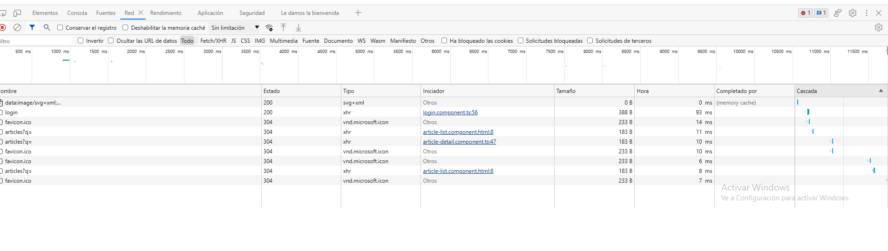

# PEC7

## ccolomerrev

## Carlos Colomer Revert

En esta práctica hemos aprendido a implemetar rutas en nuestra aplicación Angulas, así como realizar el LazyLoading.

Esta práctica me ha parecido muy necesaria e interesante, y me he encontrado varios problemas que he tenido que ir afrontando, como son:

- Inicializar una interface en el constructor llamando a un método que la inicializa, ya que Angular seguía indicando con un mensaje de error que no estaba inicializada en el constructor.
- Creando el UserStoreservivce, dado que en el libro vemos varias menciones a dicho servicio, pero no he encontrado donde lo crea, por lo que lo he hecho basándome en los servicios creados anteriormente.
- Para las rutas, en el libro se utiliza el CanActivate, y está deprecado, lo he seguido utilizando, pero me hubiera gustado ver como hacerlo para futuras versiones de Angular.
- Añadiendo el redireccionamioento cuando se hace click a una imágen, enviar el ID del producto, y mostrar sus detalles, dado que se daba a entender que había una API que pasándole el ID, devolvía dicha información, pero en el server no estaba, por lo que finalmente he tenido que obtener todos los artícluos, y filtrar por el ID, cosa que no me parece la mejor solución en el caso que tuvieramos muchos artículos.
- Implementando el LazyLoading también he tenido bastántes problemas, pero finalmente lo he podido solucionar. La captura de la imágen nos indicaste que la carpeta del proyecto, de todos modos, la pongo aquí para que la puedas visualizar:

Y como mejora, he implementado al igual que para crear un artículo tengas que estar logeado, para ver el detalle de un artículo también.